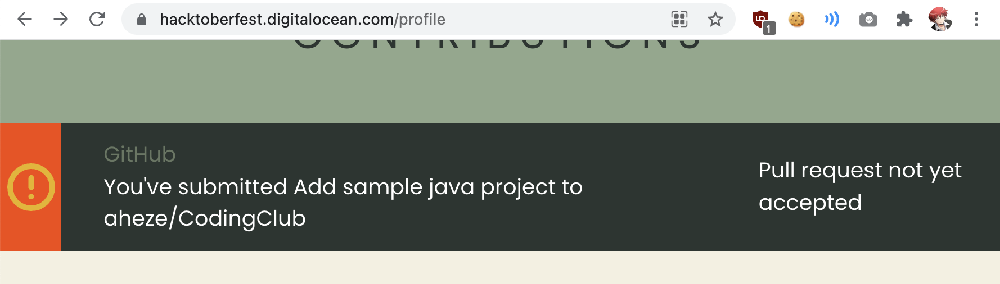
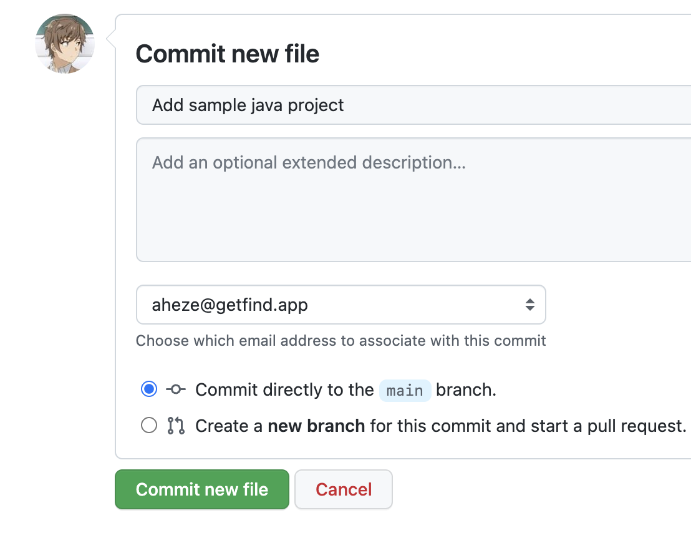

# CodingClub
AHS Coding Club demo repo

## Meeting #4 - Wednesday, October 6, 2021

Today, we'll start making pull requests for [Hacktoberfest](https://hacktoberfest.digitalocean.com/). **Hacktoberfest is an annual coding event where you can win a free t-shirt, just for writing code!**

### Setting up GitHub and linking it to Hacktoberfest
First, you'll need to make a GitHub account. That's pretty simple, just go to [github.com/signup](github.com/signup). You can use your school email or personal email, but if you're going to keep on coding, you should probably use your personal (since GitHub is so big and you're definitely going to keep using it).


Once you have GitHub set up, link it to the Hacktoberfest event site.

1. Go to [hacktoberfest.digitalocean.com](https://hacktoberfest.digitalocean.com/)


2. Click the <kbd>Start Hacking</kbd> button


3. Click <kbd>Sign up with GitHub</kbd>


4. Accept the permissions


5. Enter the info. Choose "Participant" under "Are you a..."


5. That's it! When you make pull requests later, they'll show up.




### Making a pull request

Pull requests sound scary but they just mean "code contribution." That can be adding your own code, or modifying someone else's. For now, just add your own code (could be anything).


1. Go to the [CodingClub sample repository](https://github.com/aheze/CodingClub)
    - "Repository" = folder of code

2. Click <kbd>Fork</kbd>. This will make a copy of the folder that you can edit.


3. Add a file.


4. Paste in your code!

```
print("Hello world")
```

5. Commit your changes.
    - "Commit" = save your code



6. You have added your file. Time to create a pull request now


7. Confirm that you want to create a PR


8. Thanks for the PR! We will accept it later and it will count to your 4 PRs.